# C++で拡張カルマンフィルタ(EKF)を実装する

## Abstract
* C\+\+の勉強として加速度と角速度の時系列データからカルマンフィルタを使って姿勢を計算するプログラムを書いてみる(できるだけC++11の機能を使って).
* 具体的なプログラムの流れは以下のものを考えている.
* 2016/07/07時点 : 立式が終わって満足しているところ. モチベーションが復活したらコーディング開始

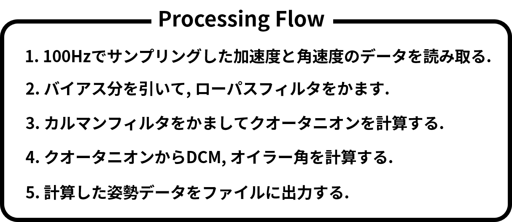

## Data Sampling
* 加速度と角速度のデータは以下のシステムを組んで取得した. 取得データは「data」に, 取得するのに使ったマイコンのプログラムは「sampling program」に置く.

## Coordinate System
* 座標系と方向余弦行列ついては以下のように設定する.

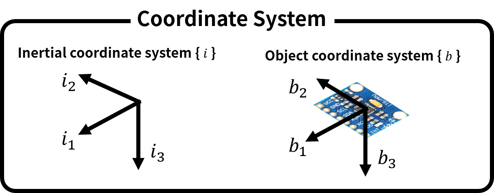

## Relationship between DCM and Euler angles and Quaternion
* DCMとオイラー角の関係, DCMとクオータニオンの関係は以下のように定義する.

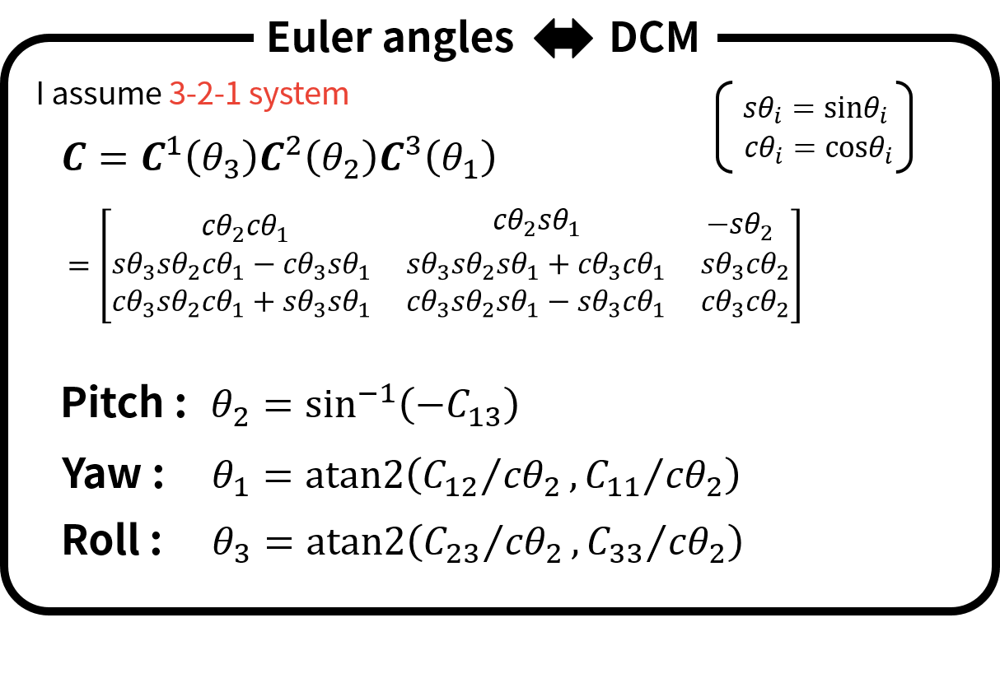
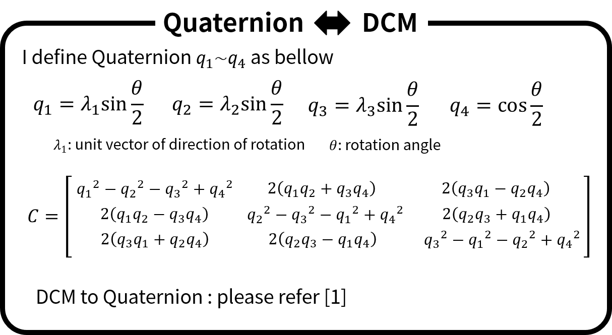

## Angular velocity
* 角速度は物体座標系で定義し, DCM とクオータニオンの時間微分との関係は以下の通りである.

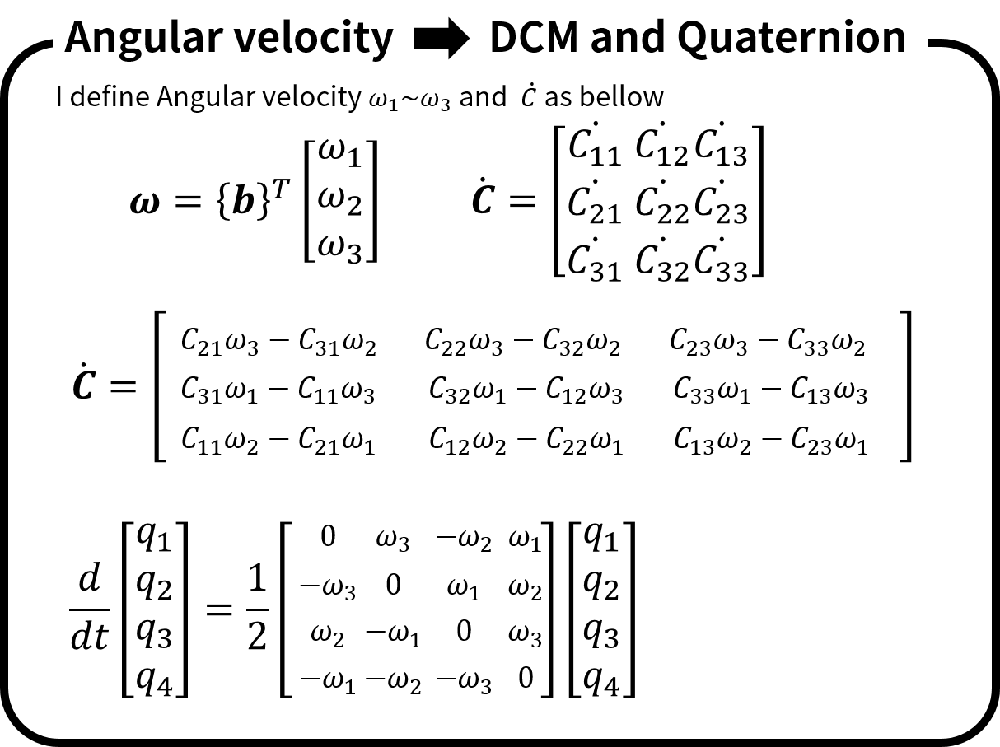

## Gravity vector in { b }
* カルマンフィルタで加速度センサの値を出力方程式で用いるためにクオータニオン(状態変数にする予定)と重力加速度の関係を導出しておく.

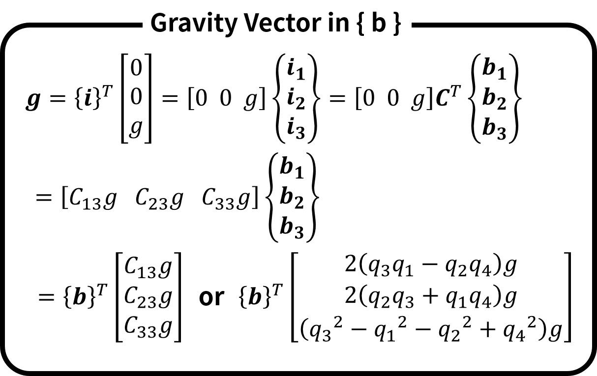

## Discretization of Quaternion
* カルマンフィルタで状態方程式を立てるためにクオータニオン(状態変数にする予定)を離散化しておく.

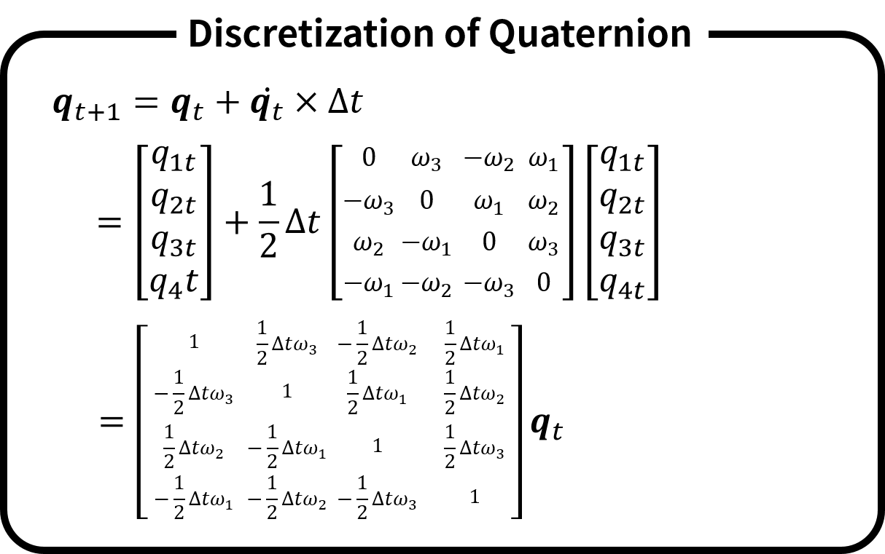

## Equation of State
* カルマンフィルタを適用させる状態方程式・観測方程式は以下のようになる. 観測方程式が非線形となっているため今回はEKFを使う.

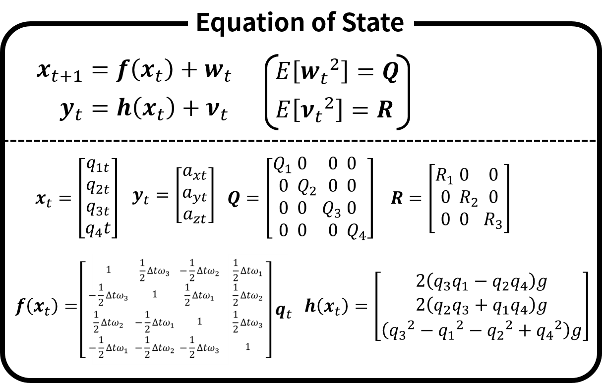

## Jacobian Matrix
* EKFを回すために状態方程式・観測方程式それぞれのヤコビアン行列を求めた.

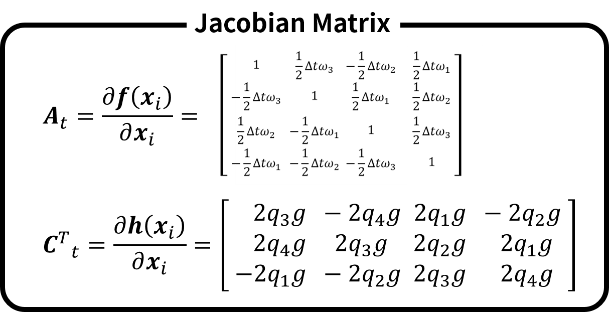

## EKF Algorithm and Initial Values
* EKFのアルゴリズムとその初期値を以下に示す.

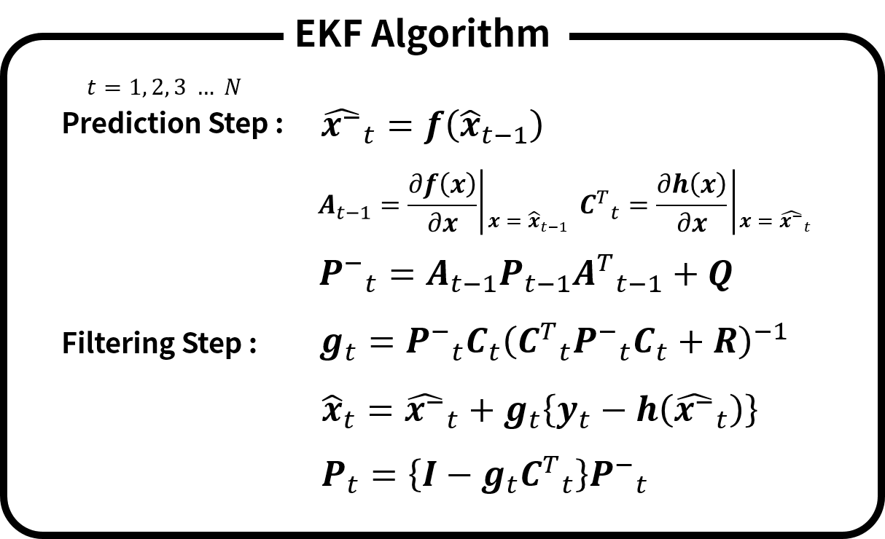
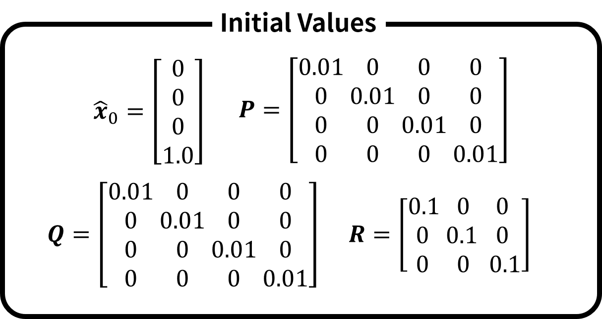

## 参考文献
* 座標系の取り方や方向余弦行列DCM, クオータニオンについて以下の資料を参考にした.  
<a href="https://repository.exst.jaxa.jp/dspace/bitstream/a-is/23926/1/naltm00636.pdf">[1]航空宇宙技術研究所資料 : クオータニオンとオイラー角によるキネマティックス表現の比較について</a>